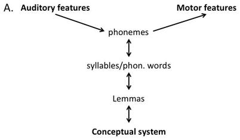
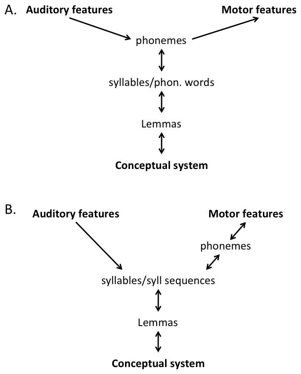

@title[Заголовок]

# Фонемы в восприятии речи

Насколько они нужны?

---
@title[Hickok's model]
## Откуда возник вопрос?

+++
@snap[north]

@snapend

+++

+++
Хикок такой не один

Пачка референсов (помню только Masaro, тоже из Хикока)

---
## Фонемы при порождении

+++
Примеры с заменой фонем

---
## Фонемы при восприятии

+++
## Selective adaptation

Пример с цветами и тем, как таким образом можно понять, к каким цветам мы чувстсвительны

+++
## Eimas & Corbit, 1973

Адаптация у них

+++
Еще примеры с адаптацией

---
## Что не нравится Хикоку?

+++
Табличка с адапторами/тестами

Note:
всюду слоги

---
## Bowers et al. (2016)

+++
### Адапторы

Примеры адапторов

+++
### Тестовые стимулы

Примеры стимулов

+++
### Есть адаптация

Картинка какая-нибудь из результатов

Note:
так как тестовые слоги не повторялись, адаптация не могла быть к слогам

+++
### Тут что не нравится Хикоку?

+++
Примеры адапторов и тестовых стимулов вместе

Note:
очевидно, что у всех этих слогов есть общий акустический знаменатель - 'б'.

---
## В чем наша идея?

@ul

- Варьировать слоги в адапторах (как у Bowers et al)
- Убрать всю акустическую информацию о целевой фонеме из адапторов

@ulend

+++
## Это как?

+++

## Samuel, 1997

### Phoneme restoration effect + selective adaptation

Примеры адапторов и тестовых стимулов

Note: 
фонема 'x' была вырезана и заменена на шум, испытуемые ничего не заметили, адаптация тем не менее произошла

---
## Наш эксперимент

Смесь Bowers et al, 2016 и Samuel, 1997

+++
### Адапторы

Примеры адапторов

+++
### Тестовые стимулы

Примеры стимулов

